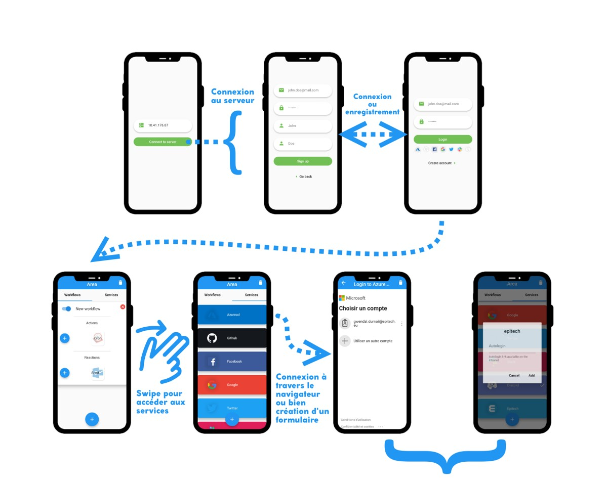

# Zia  [](LICENSE.txt)

## Introduction

**AREA** is an Epitech school project. We had to recreate the environment of IFTTT,
with a _backend_, a _web frontend_ and a _module frontend_.
 
## How to use

This project use __Docker__ and __docker-compose__ to be served. The only thing you
have to do is running:

```bash
$ docker-compose up -d --build
```

You can download the APK file of the application on the webapp under the `/client.apk`
route.

## Folder architecture

We have 3 subprojects in this repository:
- Server (under `backend`) which act as the master node of the application. It contains
  all the logic of the actions and reactions.
- Website front-end (under `webapp`) which expose a website to interact with the AREA.
- Mobile front-end (under `mobileapp`) which expose a mobile application to interact with
  the AREA.

## Technical choices

The backend is devepped in __TypeScript__ with the __NestJS framework__. Thanks to
its conception rules, we can isolate the different part of the application. This way,
we have been really fast to implement a lot of functionalities. Also, because we can
isolate the parts, we can test them separatly.

We took several directives in this subproject:
- Use `PassportJS` to perform OAuth related logins
- Use existing packages to interact with APIs, if possible
- Always create a test case when creating an action or a reaction

In our database, the actions and reactions are pretty the same thing. That's why there
is a `CRUDObject` class which bring together the common properties and methods. Under this
there is a Action and Reaction class which expose :
- a `test` function for the action (which returns a boolean if the predicate passes)
- an `apply` function for the reaction

Finally, to create a new action or reaction, we just have to create a dedicated file
and import it in the `modules.module.ts` file.

Either for an action or a reaction, you must create:
- a DTO (aka. a representation of the form the clients will _POST_ to create/modify the entity)
- an Entity (aka. the database model, containing the configuration)
- the Action or Reaction instance containing all the information needed
  - the method `authTokenProvider` is optional but permits to indicate that this object
    works with special credentials the user must provide in order to use it

## Backend UML


## Usage of mobile app



## License

See [LICENSE](LICENSE).

## Authors

- Guillaume Hector - [GitHub](https://github.com/LeChatErrant)
- Gwendal Dumail - [GitHub](https://github.com/GDumail)
- Jérémy "IamBlueSlime" Levilain - [GitHub](https://github.com/IamBlueSlime) - [Website](https://jeremylvln.fr) - [Twitter](https://twitter.com/iamblueslime)
- Jonathan Bibas - [GitHub](https://github.com/Katsuyu)
- Juel Marques-Garcia - [GitHub](https://github.com/FriendlyManiakk)
- Tatiana Relìc - [GitHub](https://github.com/Berryllion)